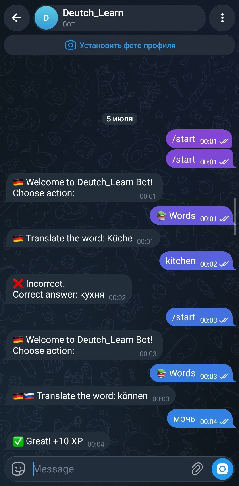

# 🇩🇪 Deutsch Learn Bot

A Telegram bot for learning German vocabulary through interactive quizzes.

Deutsch Learn Bot helps users improve their German vocabulary by practicing translations and earning XP for correct answers.

## 📌 About the Project

Learning a new language requires regular practice. This bot makes vocabulary learning more engaging by turning it into a simple quiz game.

The user receives a German word, enters the Russian translation, and gets experience points (XP) for correct answers.

## ✨ Features

- 🇩🇪 Random German vocabulary questions
- 🇷🇺 German → Russian translation practice
- ✅ Automatic answer checking
- ⭐ XP reward system
- 📊 User progress tracking
- 🎮 Interactive Telegram keyboard interface

## 📸 Screenshots

<p align="center">
  
</p>

## 🛠 Technologies

- Python 3
- Telegram Bot API
- PyTelegramBotAPI (`telebot`)
- python-dotenv
- Git & GitHub

## 📂 Project Structure

```
Deutsch_Learn_Bot/
│
├── main.py              # Main bot logic
├── words.py             # German vocabulary list
├── screenshots/         # Project screenshots
├── .env                 # Environment variables
├── requirements.txt     # Dependencies
└── README.md
```

## ⚙️ Installation & Setup

### 1. Clone the repository

```bash
git clone https://github.com/syimyq1/Deutsch_Learn_Bot.git
```

### 2. Install dependencies

```bash
pip install -r requirements.txt
```

### 3. Create environment variables

Create a `.env` file:

```env
TOKEN=your_telegram_bot_token
```

Get your Telegram Bot Token from:

```
@BotFather
```

### 4. Run the bot

```bash
python main.py
```

## 🎮 How It Works

1. Start the bot with:

```
/start
```

2. Choose:

```
📚 Words
```

3. The bot sends a German word:

Example:

```
🇩🇪 Haus
```

4. User enters the translation:

```
Дом
```

5. If the answer is correct:

```
✅ Great! +10 XP
```

## 🧠 Learning System

The current version uses a quiz-based learning system:

- A random word is selected from the vocabulary list
- The user translates the word
- The bot checks the answer
- Correct answers increase XP

## 🚀 Future Improvements

- 💾 Add SQLite database for users
- 🔄 Implement spaced repetition algorithm
- 🔊 Add German pronunciation audio
- 📚 Add vocabulary levels (A1, A2, B1, B2)
- 🏆 Add leaderboard system
- 🤖 Add AI-powered grammar assistant
- 📈 Add detailed learning statistics

## 👨‍💻 Author

**Syimyk**

GitHub:
https://github.com/syimyq1
